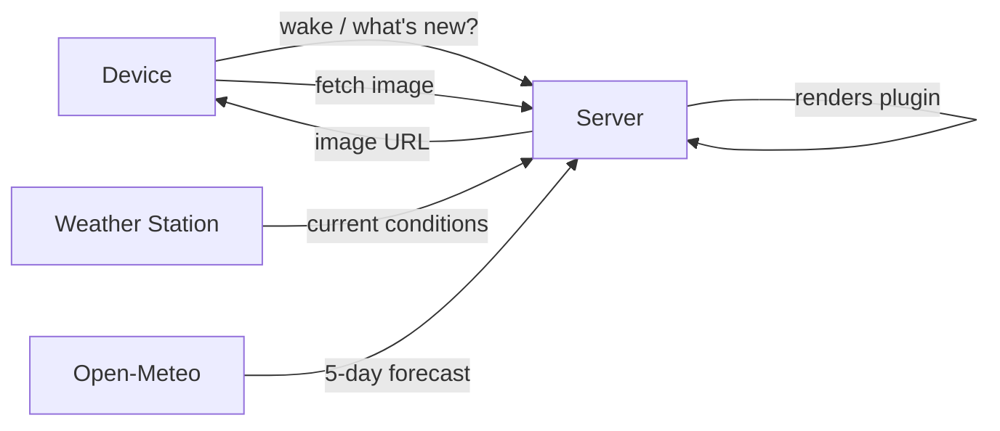

# trmnl-byos

A custom server for the [TRMNL X](https://usetrmnl.com) e-ink display. The device wakes up, asks the server what to show, downloads an image, and goes back to sleep.

## What it shows

Four plugins are available. The active one is set per-device:

| Plugin | What it displays |
|---|---|
| `clock` | Time and date |
| `weather` | Current conditions from the local weather station |
| `forecast` | 5-day forecast from Open-Meteo |
| `dashboard` | Current conditions + forecast strip (default) |

## Docs

- [DESIGN.md](DESIGN.md) — protocol details, image format, plugin system, project layout
- [DATA_FEEDS.md](DATA_FEEDS.md) — weather station JSON feed fields and weewx template
- [CLAUDE.md](CLAUDE.md) — development notes, server startup, key conventions
